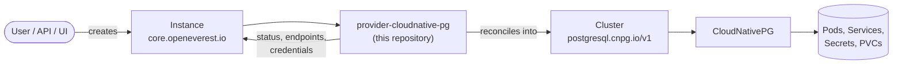

# CloudNativePG Provider

> [!WARNING]
> **Pre-alpha.** OpenEverest v2 and this provider are under active development. CRD schemas,
> chart values and defaults change frequently, including in breaking ways, and there is no
> supported upgrade path between versions yet. Not for production use.

[](https://github.com/openeverest/openeverest)
[](https://github.com/AdityaPimpalkar/provider-cloudnative-pg/actions/workflows/build.yaml)
[](https://github.com/AdityaPimpalkar/provider-cloudnative-pg/releases)
[](https://pkg.go.dev/github.com/adityapimpalkar/provider-cloudnative-pg)
[](LICENSE)

Run **PostgreSQL** on Kubernetes through
[OpenEverest](https://github.com/openeverest/openeverest), backed by
[CloudNativePG](https://cloudnative-pg.io/).

## What this is

OpenEverest providers translate a single, technology-agnostic `Instance` custom resource into
the native custom resources of an upstream Kubernetes operator — for databases, but equally
for caches, message queues, object storage, or model-serving runtimes. This repository is the
provider for **PostgreSQL via CloudNativePG**: it owns the technology-specific knowledge —
topologies, versions, parameters, backup wiring — so that users, the API server, and the UI
stay technology-agnostic.

> [!IMPORTANT]
> **This provider is not standalone.** It requires an OpenEverest installation (core CRDs and
> controller) in the cluster. Installing this chart on its own does nothing.
> See [Install OpenEverest](https://openeverest.io/documentation/current/quick-install.html).



The provider watches `Instance` resources whose `spec.providerRef.name` is
`provider-cloudnative-pg`, and reports workload health back onto `Instance.status`. It never
manages pods directly — all lifecycle work is delegated to the operator.

## Compatibility

| provider-cloudnative-pg | OpenEverest | CloudNativePG | Kubernetes |
|---|---|---|---|
| `0.2.x` | `2.0.0-dev.2` | `1.29.x` | `1.30` – `1.34` |

## Capabilities

What you can do to a running instance through the `Instance` API. Upgrading the
provider itself is covered under [Installation](#installation).

| Capability | Status | Notes |
|---|---|---|
| Provisioning | ✅ | |
| Horizontal scaling | ✅ | `spec.components.engine.replicas` |
| Vertical scaling (CPU / memory) | ✅ | `spec.components.engine.resources` |
| Version upgrades | ✅ | of the deployed PostgreSQL version — change `spec.version`; see [Versions](#versions) |
| Custom configuration | ✅ | PostgreSQL GUCs via `spec.components.engine.parameters.postgresql` |
| Bootstrap (`initdb`) | ✅ | database name, owner, and credentials secret |
| Managed roles | ✅ | CloudNativePG managed roles with readiness gating in `Status()` |
| Pod scheduling (affinity) | ✅ | `spec.components.engine.parameters.affinity` |
| Monitoring | 🚧 | optional `monitoring` component — wiring in progress; CNPG `monitoring` parameters are accepted |

Stateful workloads additionally report:

| Capability | Status | Notes |
|---|---|---|
| Persistent storage | ✅ | `spec.components.engine.storage` |
| Storage expansion | ✅ | when the StorageClass allows volume expansion (`resizeInUseVolumes`) |
| Backups (on demand) | ✅ | operator-native (`executionMode: ProviderManaged`) via the Barman Cloud Plugin; one backup storage per Instance (CNPG supports a single WAL archive) |
| Restore | ✅ | from a succeeded Backup via Barman |
| Scheduled backups / PITR | 🚧 | not yet supported |

## Installation

The provider chart is published as an OCI artifact:

```bash
helm install provider-cloudnative-pg \
  oci://ghcr.io/adityapimpalkar/charts/provider-cloudnative-pg \
  --version 0.2.2 \
  --namespace everest-system
```

- The CloudNativePG operator and the Barman Cloud Plugin (and their CRDs) are bundled as chart
  dependencies and are installed automatically. Set `cloudnative-pg.enabled=false` or
  `plugin-barman-cloud.enabled=false` to use externally managed installs instead.

> [!IMPORTANT]
> The Barman Cloud Plugin's admission webhooks require [cert-manager](https://cert-manager.io)
> to be installed in the cluster before installing this chart (when the plugin subchart is
> enabled).

Upgrade and uninstall:

```bash
helm upgrade provider-cloudnative-pg \
  oci://ghcr.io/adityapimpalkar/charts/provider-cloudnative-pg --version 0.2.2
helm uninstall provider-cloudnative-pg --namespace everest-system
```

Uninstalling the chart does **not** delete running `Instance` resources or their data.

## Usage

Verify that the provider registered itself:

```bash
kubectl get providers.core.openeverest.io provider-cloudnative-pg
```

Create an instance:

```yaml
apiVersion: core.openeverest.io/v1alpha1
kind: Instance
metadata:
  name: my-instance
spec:
  providerRef:
    name: provider-cloudnative-pg
  version: "17.10"
  components:
    engine:
      type: postgresql
      replicas: 3
      resources:
        requests:
          cpu: "1"
          memory: 1Gi
        limits:
          cpu: "1"
          memory: 1Gi
      storage:
        size: 5Gi
```

Component names are defined by this provider — see [definition/provider.yaml](definition/provider.yaml).
`spec.version` and `spec.topology` are optional; the provider defaults apply.
More examples live in [examples/](examples/).

Watch it come up and read the connection details:

```bash
kubectl get instance my-instance -w
kubectl get instance my-instance -o jsonpath='{.status.connectionSecretRef.name}'
```

The credentials (host, port, username, password, uri) live in the connection
Secret named by `.status.connectionSecretRef.name`.

## Topologies

| Topology | Default | Description |
|---|---|---|
| `replicaSet` | ✅ | A CloudNativePG primary + standby cluster built from the `engine` component (default 3 instances) |

The `backupAgent` and `monitoring` components are optional.

## Versions

| Version bundle | Default | postgresql |
|---|---|---|
| `17.10` | ✅ | `17.10` (`ghcr.io/cloudnative-pg/postgresql:17.10-standard-trixie`) |
| `18.4` | | `18.4` |
| `16.14` | | `16.14` |
| `15.18` | | `15.18` |
| `14.23` | | `14.23` |

Source of truth: [definition/versions.yaml](definition/versions.yaml).

Images follow CloudNativePG recommended practice (official CNPG operands, `standard` image type
on Debian `trixie`). The operator must already support the target version — upgrade the
provider chart first.

## Configuration

- **Chart values:** [charts/provider-cloudnative-pg/values.yaml](charts/provider-cloudnative-pg/values.yaml)
- **Instance parameters:** per-component and per-topology `parameters` schemas, defined under
  [definition/](definition/) and published on the `Provider` resource
  (`kubectl get provider provider-cloudnative-pg -o yaml`). The API server and the UI validate
  user input against these schemas.

The technology-specific knobs worth knowing about:

| Parameter | Applies to | Purpose |
|---|---|---|
| `bootstrap.initdb` | `engine` | Initial database name, owner, and optional credentials Secret |
| `postgresql` | `engine` | Full CloudNativePG `PostgresConfiguration` (GUCs, sync replicas, …) |
| `affinity` | `engine` | CloudNativePG `AffinityConfiguration` |
| `managed` | `engine` | Managed PostgreSQL roles |
| `resizeInUseVolumes` | `engine` | Allow PVC expansion on running instances |
| `certificates` | `engine` | TLS certificate configuration passthrough |
| `monitoring` | `engine` | CloudNativePG monitoring configuration |

## Development

Requires Go (see [go.mod](go.mod)), Docker, Helm, kubectl, and a Kubernetes cluster you can
reach. [dev/README.md](dev/README.md) covers the environment end to end: the recommended
local k3d setup, running against a cluster you already have, and every `dev/.env` setting.

```bash
make dev-up             # local cluster + Tilt dev environment (see dev/README.md)
make generate           # RBAC, provider spec, Helm chart sync
make run                # run the provider locally against the cluster
make test               # unit tests
make test-integration   # chainsaw suites under test/integration/
make dev-down
```

To work against a cluster you already have — kind, GKE, a shared OpenEverest Tilt cluster —
skip `make dev-up` and point Tilt at it:

```bash
cp dev/.env.example dev/.env   # set K8S_CONTEXT, and DOCKER_REGISTRY_URL for a remote registry
tilt up -f dev/Tiltfile
```

`make help` lists every target. `make verify` fails when generated files are stale — run
`make generate` and commit the result.

The provider contract (`Validate` / `Sync` / `Status` / `Cleanup`), RBAC markers, watches,
code generation, and the backup/restore interfaces are documented once for all providers in
[PROVIDER_DEVELOPMENT.md](https://github.com/openeverest/provider-sdk/blob/main/PROVIDER_DEVELOPMENT.md).

### Layout

| Path | Purpose |
|---|---|
| `cmd/provider/` | Entry point |
| `internal/provider/` | `ProviderInterface` implementation, backup interfaces, RBAC markers |
| `internal/cnpg/` | CloudNativePG-specific helpers (roles, Barman backup/restore) |
| `internal/common/` | Component name constants |
| `definition/` | Provider identity, component types, versions, topologies, backup classes |
| `charts/provider-cloudnative-pg/` | Helm chart (`generated/` is produced by `make generate`) |
| `config/rbac/role.yaml` | Generated `ClusterRole` — do not edit |
| `test/integration/` | Chainsaw suites: `core/replicaset` |
| `test/vars.sh` | Pinned versions used by tests |
| `examples/` | Example `Instance` resources |
| `dev/` | Tilt dev environment, `.env` configuration, k3d cluster config |
| `.github/workflows/` | CI: lint, build, unit and integration tests, release |

### Testing

- **Unit tests** — `make test`.
- **Integration tests** — chainsaw suites under [test/integration/](test/integration/).
  Individual suites are also exposed as make targets (`make test-integration-core`,
  `make test-integration-core-replicaset`, …).
- **CI** — [.github/workflows/build.yaml](.github/workflows/build.yaml) runs lint, build, unit
  tests, generated-file verification, and Helm lint;
  [.github/workflows/test.yaml](.github/workflows/test.yaml) runs the integration suites.

## Troubleshooting

```bash
kubectl logs -n everest-system deploy/provider-cloudnative-pg -f
```

| Symptom | Where to look |
|---|---|
| `Instance` stuck in `Creating` | `kubectl describe instance <name>` conditions, then the provider logs |
| No `Provider` resource in the cluster | Is the chart installed? Check the provider deployment logs |
| `Instance` ignored entirely | `spec.providerRef.name` must be `provider-cloudnative-pg` |
| `Cluster` created but not reconciled | Confirm CloudNativePG is running; for Barman, confirm cert-manager is installed |
| `Cluster` created but no pods | Inspect the CloudNativePG `Cluster` status — the failure is upstream in the operator |
| Backup / restore stuck | Check Barman plugin pods, `ObjectStore` / Backup CRs, and BackupStorage credentials |

## Contributing

Issues and pull requests are welcome. See
[PROVIDER_DEVELOPMENT.md](https://github.com/openeverest/provider-sdk/blob/main/PROVIDER_DEVELOPMENT.md)
and the [OpenEverest Code of Conduct](https://github.com/openeverest/openeverest/blob/main/CODE_OF_CONDUCT.md).

## Security

Report vulnerabilities per the [OpenEverest security policy](https://github.com/openeverest/openeverest/blob/main/SECURITY.md).
Please do not open public issues for security reports.

## License

Apache License 2.0 — see [LICENSE](LICENSE) for details.
